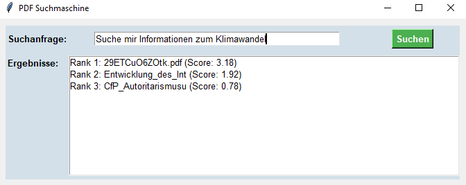

# PDF Search Engine

This project provides a graphical user interface (GUI) for searching PDF documents. The application uses modern tools like PyTerrier, spaCy, and PyPDF2 to enable efficient search functionality.

## Features

### PDF Text Extraction
Text is extracted from PDF documents and prepared for indexing.

### Indexing
PDFs are stored in a BM25 index using PyTerrier.

### Fast Search
Users can input a search query through the GUI, and the best results will be listed.

### Search Optimization
Search queries are cleaned of stopwords and special characters using spaCy.

### User-Friendly Interface
The intuitive GUI ensures ease of use.

